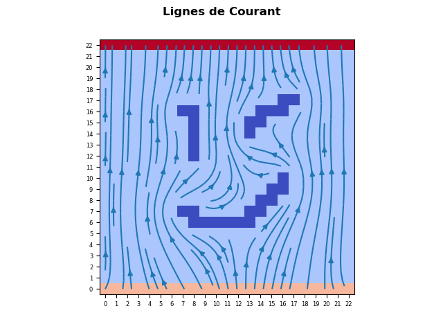

# Potential-flow
Calculates potential flow in 2D, using the finite differences method to solve the potential flow equation.
Takes as input a matrix of integers (from 0 to 3), where 0 is an obstacle, 1 a cell with fluid, and 2 and 3 represent where the fluid enters and exits.
Project assignment, for Computational Physics Master, Université de Franche-Comté

